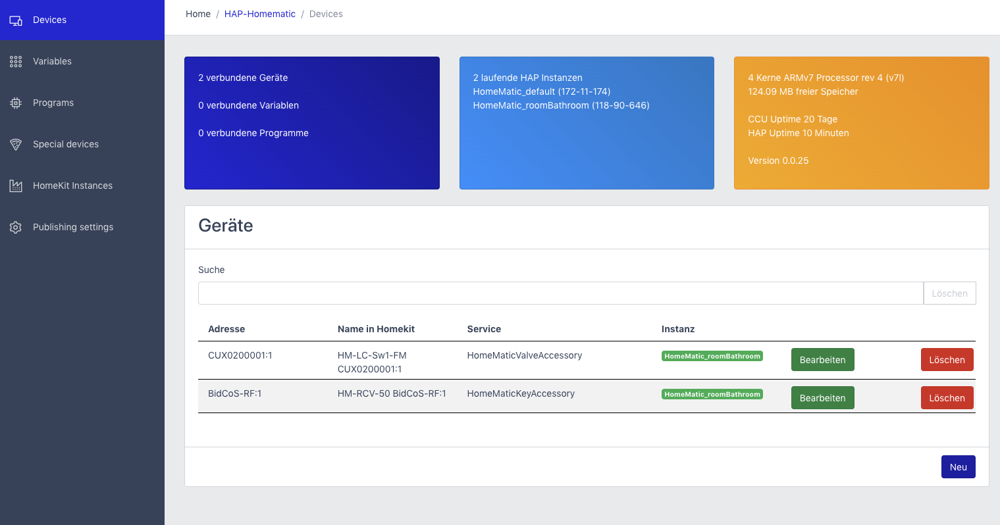

# hap-homematic

    

a Raspberrymatic / CCU3 AddOn

This RaspberryMatic / CCU3 AddOn will allow you to access your HomeMatic devices from HomeKit. Its much like https://github.com/thkl/homebridge-homematic but without homebridge.
All this runs on your RaspberryMatic / CCU3. You will not need any extra hardware.

# Installation
Download the Addon: https://github.com/thkl/hap-homematic/raw/master/addon_installer/hap-homematic-0.0.3.tar.gz and install it via System preferences.

A little bit later (the AddOn will install all other needed software) you will have a HomeKit Button in your CCU system preference page.

This will not run on a older CCU2 model.

Used Ports : 
9874 -> Config WebUI

9875 -> RPC Event Server
9876 -> RPC Event Server CuxD (optional)

9877..n HAP Instance 0 .. n

make sure your CCU firewall does not block these ports

# Issues and not supported devices
Please open an issue here for all what went wrong.